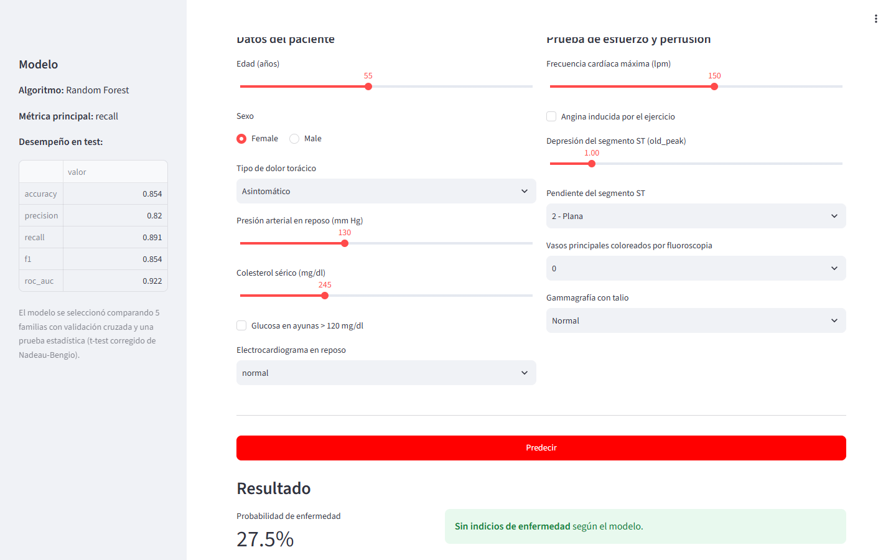
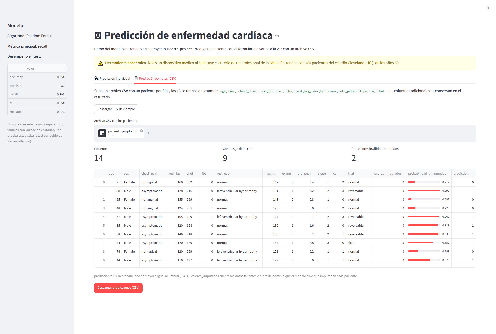

# Demo - Predicción de enfermedad cardíaca

Aplicación web en Streamlit que expone el modelo entrenado en el proyecto, con dos modos en la
misma interfaz:

| Modo | Pestaña | Issue |
| --- | --- | --- |
| Predicción individual (online) | 🩺 Predicción individual | [#15](https://github.com/ronaldo-duran/Hearth-project/issues/15), [#29](https://github.com/ronaldo-duran/Hearth-project/issues/29) |
| Procesamiento por lotes (batch) | 📄 Predicción por lotes (CSV) | [#30](https://github.com/ronaldo-duran/Hearth-project/issues/30) |

**App publicada:** <https://hearth-project-kbhgwhjjcsppxjrrrmfknp.streamlit.app/>

## Cómo ejecutarlo en local

Desde la raíz del repositorio:

```bash
uv sync
```

```bash
uv run streamlit run src/inference/app.py
```

La aplicación queda disponible en <http://localhost:8501> y se abre sola en el navegador.

Para ejecutarla sin que abra el navegador (por ejemplo en un servidor):

```bash
uv run streamlit run src/inference/app.py --server.headless true
```

## Cómo se usa

### Predicción individual

1. Abrir la pestaña **🩺 Predicción individual**.
2. Completar los 13 campos del examen (todos tienen un valor por defecto razonable).
3. Pulsar **Predecir**.
4. La app muestra la probabilidad estimada, la decisión según el umbral y, en un desplegable,
   los datos exactos que se enviaron al modelo.

### Predicción por lotes (CSV)

1. Abrir la pestaña **📄 Predicción por lotes (CSV)**.
2. (Opcional) Pulsar **Descargar CSV de ejemplo** para obtener un archivo con el formato correcto.
3. Subir un archivo CSV con un paciente por fila.
4. La app muestra el total de pacientes, cuántos tienen riesgo detectado y cuántos tenían valores
   inválidos, junto con la tabla de predicciones.
5. Pulsar **Descargar predicciones (CSV)** para guardar el resultado.

#### Formato del archivo de entrada

Un CSV con encabezado y estas 13 columnas (el orden no importa; las columnas adicionales, como un
identificador de paciente, se conservan en el resultado):

| Columna | Descripción | Valores válidos |
| --- | --- | --- |
| `age` | Edad en años | 0 a 120 |
| `sex` | Sexo | `Female`, `Male` |
| `chest_pain` | Tipo de dolor torácico | `typical`, `nontypical`, `nonanginal`, `asymptomatic` |
| `rest_bp` | Presión arterial en reposo (mm Hg) | 50 a 250 |
| `chol` | Colesterol sérico (mg/dl) | 100 a 600 |
| `fbs` | Glucosa en ayunas > 120 mg/dl | `0`, `1` |
| `rest_ecg` | Electrocardiograma en reposo | `normal`, `ST-T wave abnormality`, `left ventricular hypertrophy` |
| `max_hr` | Frecuencia cardíaca máxima | 60 a 220 |
| `exang` | Angina inducida por el ejercicio | `0`, `1` |
| `old_peak` | Depresión del segmento ST | 0 a 10 |
| `slope` | Pendiente del segmento ST | `1`, `2`, `3` |
| `ca` | Vasos coloreados por fluoroscopia | `0`, `1`, `2`, `3` |
| `thal` | Gammagrafía con talio | `normal`, `fixed`, `reversable` |

Un valor vacío o fuera de estos dominios no detiene el lote: se trata como faltante y el modelo lo
imputa, igual que durante el entrenamiento. Si falta alguna de las 13 columnas, la app muestra un
error y no genera predicciones.

#### Columnas de salida

| Columna | Descripción |
| --- | --- |
| `valores_imputados` | Cantidad de valores vacíos o inválidos que el modelo tuvo que imputar en el registro |
| `probabilidad_enfermedad` | Probabilidad estimada de enfermedad coronaria (0 a 1) |
| `prediccion` | `1` si la probabilidad es mayor o igual al umbral de decisión (riesgo detectado), `0` si no |

#### Archivos de ejemplo

| Archivo | Contenido |
| --- | --- |
| [`ejemplos/pacientes_ejemplo.csv`](ejemplos/pacientes_ejemplo.csv) | Entrada: 14 pacientes; los 2 últimos traen errores a propósito (valores vacíos, texto en `chol`, categoría `desconocido`) |
| [`ejemplos/predicciones_ejemplo.csv`](ejemplos/predicciones_ejemplo.csv) | Salida esperada al procesar el archivo anterior |

El mismo resultado se obtiene sin la app, con el inference pipeline:

```bash
uv run python src/pipelines/inference_pipeline/inference_pipeline.py src/inference/ejemplos/pacientes_ejemplo.csv
```

## Evidencia de funcionamiento

Capturas de la app publicada en Streamlit Community Cloud.

**Predicción individual:** formulario con el resultado de la predicción.



**Predicción por lotes:** `ejemplos/pacientes_ejemplo.csv` cargado, con las métricas del lote,
la tabla de predicciones y el botón de descarga.



## Qué necesita para funcionar

La app usa el inference pipeline (`src/pipelines/inference_pipeline`), que carga dos artefactos
versionados en el repositorio:

| Archivo | Contenido |
| --- | --- |
| `models/modelo_final.joblib` | Pipeline completo: preprocesamiento + Random Forest |
| `models/modelo_final_metadatos.joblib` | Algoritmo, métrica principal y resultados en test |

Como el `.joblib` contiene el **pipeline completo**, la app envía los datos en su formato
**crudo** (`Male`, `asymptomatic`, `reversable`…) y el propio pipeline se encarga de imputar,
escalar y codificar. El tipado de la entrada es el mismo `tipar_datos()` del feature pipeline, así
que la demo y el entrenamiento no se pueden desincronizar.

## Publicar en Streamlit Community Cloud

El repositorio ya cumple los requisitos: es público, los `.joblib` están versionados y
`requirements.txt` fija las versiones exactas con las que se serializó el modelo.

1. Entrar a <https://share.streamlit.io> e iniciar sesión con la cuenta de GitHub.
2. **New app** → **Deploy a public app from GitHub**.
3. Completar:
   - Repository: `ronaldo-duran/Hearth-project`
   - Branch: `main`
   - Main file path: `src/inference/app.py`
4. En **Advanced settings**, elegir Python **3.12** (el del proyecto, según `.python-version`).
5. **Deploy**. La primera instalación tarda unos minutos.

Cada merge a `main` vuelve a desplegar la app automáticamente.

> **Importante**: no fue posible usar `pyproject.toml` porque Streamlit Community Cloud no
> instala dependencias con uv. Por eso existe `requirements.txt` en la raíz, con las
> versiones **fijadas exactamente**: un `scikit-learn` distinto al que serializó
> `modelo_final.joblib` puede fallar al deserializarlo o cambiar su comportamiento sin
> avisar.

## El umbral de decisión

La app usa un umbral de **0.411** en lugar del 0.5 por defecto. No es arbitrario: sale del
análisis del [issue #14](https://github.com/ronaldo-duran/Hearth-project/issues/14).

En screening cardíaco el falso negativo (dar por sano a un paciente enfermo) es mucho más
grave que el falso positivo (mandar a un sano a un examen adicional). Bajar el umbral sube
el recall de 0.891 a 0.913 a costa de precision, y ese intercambio es el correcto para este
problema.

El umbral está en la constante `UMBRAL_DECISION` de `src/pipelines/config.py`, compartida por la
app y el inference pipeline.

## Desempeño del modelo

| Métrica | Test |
| --- | --- |
| accuracy | 0.854 |
| recall | 0.891 |
| ROC-AUC | 0.922 |

## Aviso

Es una **herramienta académica**, no un dispositivo médico. El modelo se entrenó con 480
pacientes del estudio Cleveland (UCI) de los años 80 y no está validado clínicamente. No
sustituye el criterio de un profesional de la salud.
